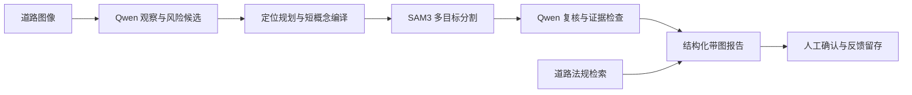

# 路安智巡 · SmartRoad-Highway

面向高速公路建设与管理的道路风险检测实验室原型。当前版本 **1.4.5**，通过 Qwen 观察与复核、SAM3 多概念定位、道路法规检索和带图问题报告，把图像中的风险线索转为可追溯、可人工复核的管理记录。当前重点验证服务器端分析，端侧实时模型暂缓训练。

- [项目介绍与测试分析](docs/PROJECT_INTRO_ANALYSIS.md)
- [下载完整带图报告 HTML](https://github.com/Shrek2356/SmartRoad-Highway/releases/download/v1.4.4/road-v5-analysis-report.html) · [报告与原始附件 ZIP](https://github.com/Shrek2356/SmartRoad-Highway/releases/download/v1.4.4/road-v5-analysis-bundle-20260922.zip)
- [下载 1.4.5 安装包及可导入历史档案](https://github.com/Shrek2356/SmartRoad-Highway/releases/tag/v1.4.5)
- [1.4.5 安装、升级及档案保留验证](docs/validation/v1.4.5/README.md)
- [应用源码及使用说明](combine/ZNT/README.md)
- [环境部署说明](combine/ZNT/requirements/README.md)
- [1.4.4 测试与验证摘要](docs/validation/v1.4.4/README.md)
- [检测历史与原图归档](docs/DETECTION_HISTORY.md)：历史原图、标注、掩码及报告导入与长期留存。
- [道路领域迁移检查](combine/ZNT/docs/道路领域全面迁移检查_20260921.md)

## 当前能力与边界

区分普通湿润路面与可见积聚水体，支持同图多种风险和多个分割实例。正常场景显示绿色道路框，路牌作为蓝色场景对象标注。报告按风险 ID 关联原图、掩码和复核结论。可检测的候选包括路面破损、积水淹没、散落物、阻塞、塌方、火情及交通设施异常；不能以掩码存在代替精准检测或人工确认。

真实 Qwen/SAM3 开发测试已完成 15 张图，仍存在误分、漏分和边界不准。这是小试开发结果，不是独立数据集准确率或真实高速试点结论。

## 实际检测示例与分析

以下图片原样取自本次模型输出。S02、S04、S10 为合成高速场景，N03 为 UA-DETRAC 真实城市道路正常候选图。选图用于解释功能，完整报告保留全部 15 张结果。

| 普通湿路：S10 | 淹水覆盖道路：S02 |
|---|---|
|  |  |
| 湿润反光本身未被报为积水，输出“未见可见异常”。 | 保留积水候选并生成水体掩码；边界仍需复核，不能从图片估计水深。 |

| 多种散落物：S04 | 真实湿路正常候选：N03 |
|---|---|
|  |  |
| 同图可保留散落物与阻塞等标签；本图阻塞定位复核未通过，不能把有掩码视为正确。 | 本图未见可见异常，正常车流和湿路面没有直接升级为事故或淹水。 |

| 本次开发测试 | 结果 |
|---|---|
| 样本范围 | 10 张高速合成场景 + 5 张 UA-DETRAC 正常候选图 |
| 流程运行 | 15/15 完成，0 运行错误 |
| 风险观察与对应叠加图 | 17 项、17 张；全部保留业务复核要求 |
| 内部自动证据支持 | 7 项；是程序一致性判断，不是人工核验准确率 |
| 新增正常候选图 | 5/5 显示绿色道路框 |
| 处理耗时 | 平均 17.0 秒/张，不含模型加载，不能外推为视频实时性能 |

绿色框表示该张图像未见可见异常；蓝色框表示路牌等场景对象。掩码、框和分数均为模型预测。水体边界、小碎片、背景同类目标与事故推断仍是下一步改进重点。HTML 报告内嵌 47 张图片，下载后用浏览器打开；需要查看逐图 JSON、掩码及日志时，下载并完整解压附件 ZIP。

## 工作流程

报告依据已保存的观察、掩码、复核和法规检索结果组织，分别说明“观察到什么”“定位是否可信”“是否需要人工确认”。法规用于条件性处置参考；普通微信推送、连续视频时序验证和端侧模型仍需后续独立验证。

## SmartRoad-Highway 与 SmartRoad-Inspection 的关系

| 名称 | 用途 |
|---|---|
| **SmartRoad-Highway** | 当前道路项目主仓库，2026-09-22 建立；后续开发和同步使用本仓库。 |
| [SmartRoad-Inspection](https://github.com/Shrek2356/SmartRoad-Inspection) | 2026-09-13 建立的旧迁移仓库；核对时远端仍是早期基线 `4740ff3`，保留作历史追溯。 |
| `SmartRoad-Inspection.exe`、同名安装目录 | 当前 1.4.5 软件沿用的程序与安装名称，承载的已是新版道路流程；不是另一套模型。 |

两个 GitHub 仓库均为私有。`Inspection` 是“巡检、检测”的意思；仓库名称和软件安装名称属于不同层次。

## 源码开发

本仓库包含项目源码、道路配置模板、法规出处与校验记录、测试、构建脚本、验证摘要及少量报告预览图。完整数据集、Python/Node/GPU 环境、模型权重、个人配置与业务数据库在本地管理；Release 中的分析报告仅附本批测试样本与输出。历史兼容模块保留，但产品入口采用道路配置。

在 `combine/ZNT` 中安装所需依赖；前端位于 `pc-admin`，执行 `npm ci`、`npm test`、`npm run build`。基础服务依赖见 `requirements/detect-bridge.txt`，完整检测环境见 `requirements/DEPLOYMENT_GUIDE.md`，自动回归依赖见 `requirements/test.txt`。复制 `desktop-settings.example.json` 为 `desktop-settings.json`，将 `backend_python` 指向本机已安装依赖的 Python；个人桌面配置不提交 Git。

道路后端入口位于 `combine/ZNT/detectmodel/Site_Safety_OpenRisk`，真实本地检测选择 `configs/road_offline.yaml`，模拟联调选择 `configs/road_demo.yaml`。构建桌面 EXE 前先构建前端并准备桌面依赖，见 `combine/ZNT/desktop/README.md`。

## 同步与发布

此仓库是从 2026-09-22 的当前工作区整理出的道路版源码基线，旧仓库和原始本地工作区保留。后续开发在本仓库提交并推送至 `main`。安装程序通过 GitHub Release 单独提供，不放入 Git 文件历史。

项目与第三方许可见 [LICENSE](LICENSE)、[THIRD_PARTY_NOTICE.md](THIRD_PARTY_NOTICE.md) 和 [COMPETITION_SUBMISSION_NOTICE.md](COMPETITION_SUBMISSION_NOTICE.md)。
