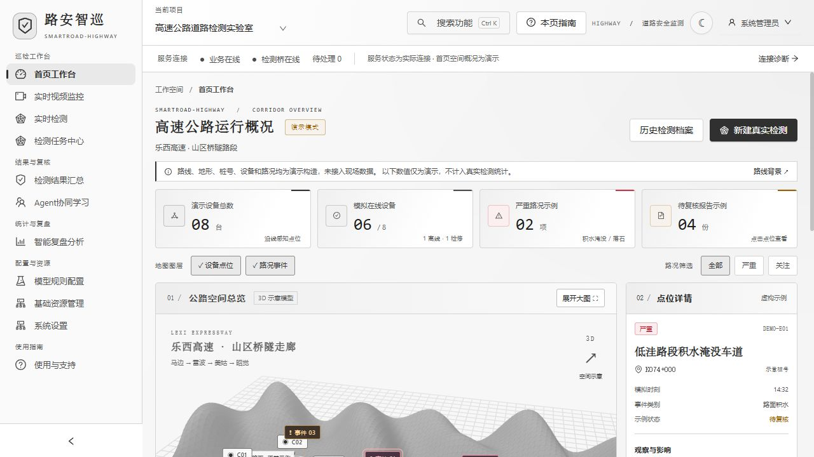
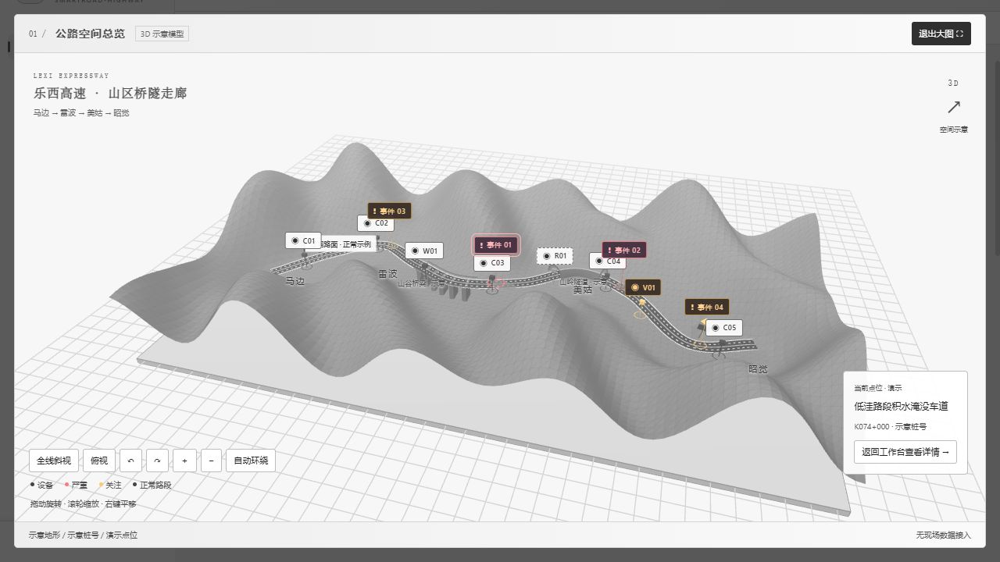
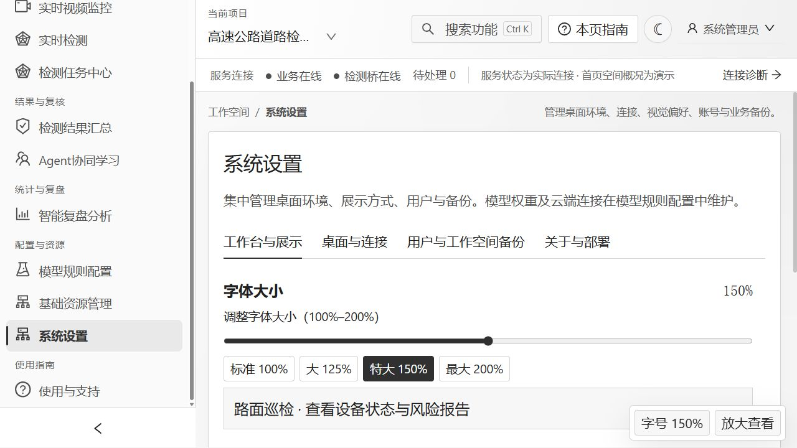
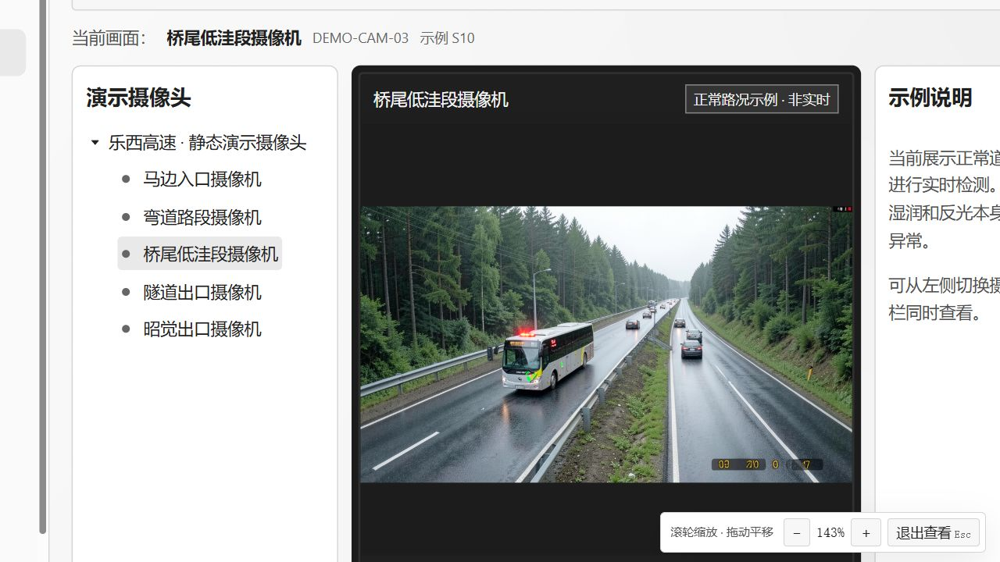
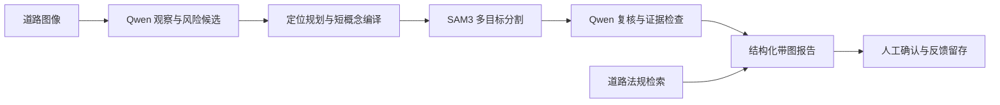

# 路安智巡 · SmartRoad-Highway

面向高速公路建设与管理的道路风险检测实验室原型，集道路概况、摄像头查看、图像风险分析、带图报告和历史档案于一体。系统通过 Qwen 观察与复核、SAM3 多概念定位及道路法规检索，把图像中的风险线索转为可追溯、可人工复核的管理记录。当前重点验证服务器端分析，端侧实时模型暂缓训练。

[下载 Windows 安装包 v1.4.6](https://github.com/Shrek2356/SmartRoad-Highway/releases/download/v1.4.6/SmartRoad-Inspection_Setup_v1.4.6_x64.exe) · [安装与验证](docs/validation/v1.4.6/README.md) · [项目与测试分析](docs/PROJECT_INTRO_ANALYSIS.md) · [应用使用说明](combine/ZNT/README.md) · [带图分析报告下载](https://github.com/Shrek2356/SmartRoad-Highway/releases/download/v1.4.4/road-v5-analysis-report.html)

> **版本说明：** 最新安装包 **v1.4.6** 已包含下方展示的深蓝／水墨主题、三维概况、摄像头联动、字号与画面放大功能，可直接下载安装。基础包自带界面与服务运行时；真实检测所需模型权重及 GPU 环境另行配置。项目仍处于实验室小试阶段。

## 应用能做什么

| 模块 | 使用方式与输出 |
| --- | --- |
| 公路概况工作台 | 旋转三维道路示意模型，联动查看设备位置、状态及路况报告；默认使用乐西高速走廊的虚构演示数据。 |
| 摄像头监控 | 从设备列表双击摄像头名称进入对应画面，支持单画面及多分栏；演示图片与真实设备入口分开。 |
| 道路风险检测 | 提交图片，观察风险候选、同图多标签、目标定位与复核结果；区分普通湿路和可见积水侵占道路。 |
| 问题报告与历史档案 | 按风险关联原图、标注、掩码和处理建议；导入或归档历史检测，保留原始证据与未确认状态。 |
| 界面与阅读设置 | 切换深蓝工业风格／黑白水墨风格；调整字号并保存，或保持布局整体放大查看细节。 |

## 界面与操作介绍

下图均为应用实际界面截图，可点击查看原图。概况中的路线、桩号、设备和路况为演示构造，监控参考图为静态样例；实际模型输出在后面的“实际检测示例与分析”中单独展示。

### 深蓝工业工作台与水墨明亮模式

首页集中显示设备概况、路况等级、三维点位与报告详情。右上角主题按钮可切换明暗模式并保存选择。水墨模式使用黑白灰文字和面板，黄红警示保持可辨识；道路照片与检测证据保留原色。

| 深蓝工业风格 | 黑白水墨风格 |
| --- | --- |
|  |  |

### 可旋转的公路三维概况

默认示意模型包含山区地形、双向道路、桥梁、隧道、8 台演示设备和 4 份演示路况报告。拖动旋转视角，滚轮缩放，右键平移；支持俯视、全线斜视、自动环绕和展开大图。点击设备或事件点位查看对应详情，也可按风险等级筛选。

[查看三维概况与设备联动说明](docs/HIGHWAY_OVERVIEW.md) · [查看水墨主题说明](docs/INK_LIGHT_THEME.md)

### 摄像头与监控画面联动

在首页下方设备台账中，**双击摄像头名称**即可打开对应的监控单画面；也可在点位详情中进入。监控页按设备 ID 匹配名称与图片，支持设备树切换和 1／4／9／16 分栏。

演示摄像头配有白天、夜间及湿润路面的正常参考图，取自既有测试样例，**不是乐西高速现场实时画面**。真实设备连接失败时显示错误，不自动改用演示图。

### 字号调节与不挤压布局的画面放大

在 **系统设置 → 工作台与展示 → 字体大小** 中选择 **100%–200%** 字号，立即生效并自动保存；右下角“字号”也可快速调整。

需要查看细节时，点击 **放大查看** 后滚动滚轮，或直接使用 **Ctrl＋滚轮**，将当前画面整体放大至最高 **400%**。这种放大保持原有列宽与排版，左键拖动平移，按 **Esc** 恢复页面操作。查看模式下暂时锁定页面按钮，避免拖动时误触。

| 字号设置：150% 示例 | 监控画面：整体放大约 143% |
| --- | --- |
|  |  |

[查看字号与放大操作、验证记录](docs/READING_AND_ZOOM.md)。本轮前端测试 42 项通过，已实测字号保存、滚轮缩放、平移、Esc 恢复、指南弹窗及摄像头图片联动；这些界面验证不构成新的模型检测性能结论。

## 快速体验与资料

1. 打开软件进入首页，查看演示概况，展开三维模型并选择设备或路况点位。
2. 双击设备台账中的摄像头名称，查看对应正常道路参考图。
3. 在系统设置中选择字体大小，使用右下角“放大查看”检查图像和文字细节。
4. 查看已有带图报告与历史档案；运行新的真实检测前，按部署说明配置模型及服务。

- [完整带图报告 HTML](https://github.com/Shrek2356/SmartRoad-Highway/releases/download/v1.4.4/road-v5-analysis-report.html) · [报告与原始附件 ZIP](https://github.com/Shrek2356/SmartRoad-Highway/releases/download/v1.4.4/road-v5-analysis-bundle-20260922.zip)
- [v1.4.6 安装包及可导入历史档案](https://github.com/Shrek2356/SmartRoad-Highway/releases/tag/v1.4.6) · [安装与档案保留验证](docs/validation/v1.4.6/README.md)
- [检测历史与原图归档](docs/DETECTION_HISTORY.md)：历史原图、标注、掩码及报告导入与长期留存。
- [环境部署说明](combine/ZNT/requirements/README.md) · [v1.4.4 模型测试与验证摘要](docs/validation/v1.4.4/README.md)
- [道路领域迁移检查](combine/ZNT/docs/道路领域全面迁移检查_20260921.md)

## 当前能力与边界

区分普通湿润路面与可见积聚水体，支持同图多种风险和多个分割实例。正常场景显示绿色道路框，路牌作为蓝色场景对象标注。报告按风险 ID 关联原图、掩码和复核结论。可检测的候选包括路面破损、积水淹没、散落物、阻塞、塌方、火情及交通设施异常；不能以掩码存在代替精准检测或人工确认。

真实 Qwen/SAM3 开发测试已完成 15 张图，仍存在误分、漏分和边界不准。这是小试开发结果，不是独立数据集准确率或真实高速试点结论。

## 实际检测示例与分析

以下图片原样取自本次模型输出。S02、S04、S10 为合成高速场景，N03 为 UA-DETRAC 真实城市道路正常候选图。选图用于解释功能，完整报告保留全部 15 张结果。

| 普通湿路：S10 | 淹水覆盖道路：S02 |
|---|---|
|  |  |
| 湿润反光本身未被报为积水，输出“未见可见异常”。 | 保留积水候选并生成水体掩码；边界仍需复核，不能从图片估计水深。 |

| 多种散落物：S04 | 真实湿路正常候选：N03 |
|---|---|
|  |  |
| 同图可保留散落物与阻塞等标签；本图阻塞定位复核未通过，不能把有掩码视为正确。 | 本图未见可见异常，正常车流和湿路面没有直接升级为事故或淹水。 |

| 本次开发测试 | 结果 |
|---|---|
| 样本范围 | 10 张高速合成场景 + 5 张 UA-DETRAC 正常候选图 |
| 流程运行 | 15/15 完成，0 运行错误 |
| 风险观察与对应叠加图 | 17 项、17 张；全部保留业务复核要求 |
| 内部自动证据支持 | 7 项；是程序一致性判断，不是人工核验准确率 |
| 新增正常候选图 | 5/5 显示绿色道路框 |
| 处理耗时 | 平均 17.0 秒/张，不含模型加载，不能外推为视频实时性能 |

绿色框表示该张图像未见可见异常；蓝色框表示路牌等场景对象。掩码、框和分数均为模型预测。水体边界、小碎片、背景同类目标与事故推断仍是下一步改进重点。HTML 报告内嵌 47 张图片，下载后用浏览器打开；需要查看逐图 JSON、掩码及日志时，下载并完整解压附件 ZIP。

## 工作流程

报告依据已保存的观察、掩码、复核和法规检索结果组织，分别说明“观察到什么”“定位是否可信”“是否需要人工确认”。法规用于条件性处置参考；普通微信推送、连续视频时序验证和端侧模型仍需后续独立验证。

## SmartRoad-Highway 与 SmartRoad-Inspection 的关系

| 名称 | 用途 |
|---|---|
| **SmartRoad-Highway** | 当前道路项目主仓库，2026-09-22 建立；后续开发和同步使用本仓库。 |
| [SmartRoad-Inspection](https://github.com/Shrek2356/SmartRoad-Inspection) | 2026-09-13 建立的旧迁移仓库；核对时远端仍是早期基线 `4740ff3`，保留作历史追溯。 |
| `SmartRoad-Inspection.exe`、同名安装目录 | 当前 1.4.6 软件沿用的程序与安装名称，承载的已是新版道路流程；不是另一套模型。 |

`SmartRoad-Highway` 已按项目所有者要求公开，便于分享给老师。`Inspection` 是“巡检、检测”的意思；仓库名称和软件安装名称属于不同层次。

## 源码开发

本仓库包含项目源码、道路配置模板、法规出处与校验记录、测试、构建脚本、验证摘要及少量报告预览图。完整数据集、Python/Node/GPU 环境、模型权重、个人配置与业务数据库在本地管理；Release 中的分析报告仅附本批测试样本与输出。历史兼容模块保留，但产品入口采用道路配置。

在 `combine/ZNT` 中安装所需依赖；前端位于 `pc-admin`，执行 `npm ci`、`npm test`、`npm run build`。基础服务依赖见 `requirements/detect-bridge.txt`，完整检测环境见 `requirements/DEPLOYMENT_GUIDE.md`，自动回归依赖见 `requirements/test.txt`。复制 `desktop-settings.example.json` 为 `desktop-settings.json`，将 `backend_python` 指向本机已安装依赖的 Python；个人桌面配置不提交 Git。

道路后端入口位于 `combine/ZNT/detectmodel/Site_Safety_OpenRisk`，真实本地检测选择 `configs/road_offline.yaml`，模拟联调选择 `configs/road_demo.yaml`。构建桌面 EXE 前先构建前端并准备桌面依赖，见 `combine/ZNT/desktop/README.md`。

## 同步与发布

此仓库是从 2026-09-22 的当前工作区整理出的道路版源码基线，旧仓库和原始本地工作区保留。后续开发在本仓库提交并推送至 `main`。安装程序通过 GitHub Release 单独提供，不放入 Git 文件历史。

项目与第三方许可见 [LICENSE](LICENSE)、[THIRD_PARTY_NOTICE.md](THIRD_PARTY_NOTICE.md) 和 [COMPETITION_SUBMISSION_NOTICE.md](COMPETITION_SUBMISSION_NOTICE.md)。
