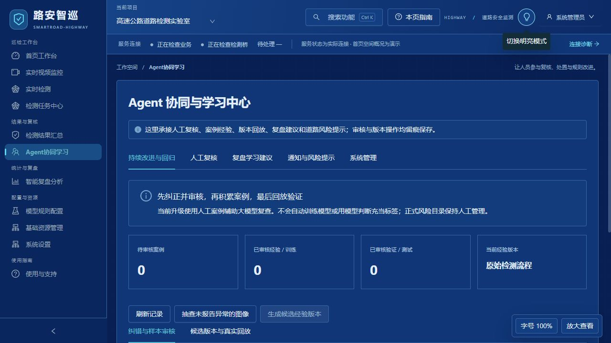
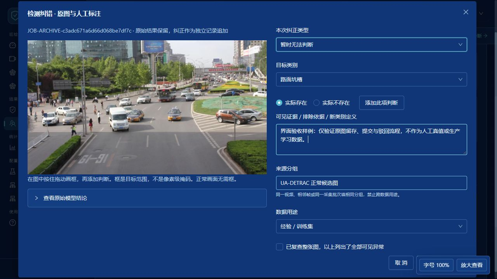
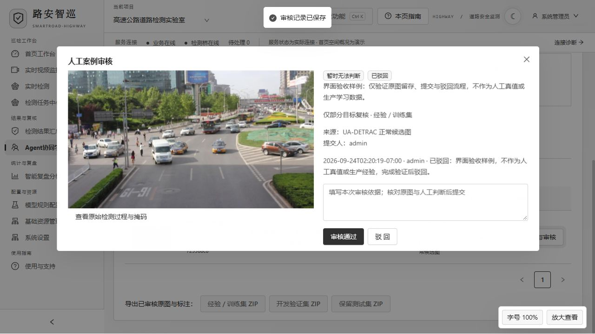

# 持续改进与回归 · v1.5.0

本版将道路检测中的人工纠正接入后续视觉复查，并提供候选版本、真实模型配对回放和回退。属于实验室工作流升级，不代表模型已经完成微调或识别精度已经提升。

## 纠错与补标

在实时检测结果、历史任务或关联真实任务的结果卡片点击 **纠错与补标**。支持误报、漏检、类别错误、定位错误、新类别候选、正常复查和暂时无法判断。一图可填写多个类别；同类别暂按一个合并范围框记录，不提供像素级掩码编辑。

在原图上拖动绘制范围，选择类别及实际存在／不存在，点击 **添加此项判断**，再填写可见证据和来源分组。误报须明确排除类别；漏检、定位错误和新类别须给出目标范围；正常或评测样本必须整图复查。

来源分组用于隔离相邻帧、同视频和同采集批次。默认值只是填写辅助，须按真实来源核对；不能靠改名让同源数据跨集合。系统同时检查完全相同的原图哈希。它不能自动识别所有近重复图片。

原图复制到案例库，原始模型结果以快照保留。提交后为待审核状态，不能直接影响检测。进入 **Agent 协同与学习中心 → 持续改进与回归** 查看原图、标注与审核依据。审核员可通过、驳回或撤回；只读用户不能提交、审核或启用版本。

以上界面截图来自隔离的界面验收环境。测试填写用于验证交互，不作为已完成的人工评测或生产经验。

## 案例如何进入大模型

管理员从审核通过的经验／训练样本生成不可变的候选版本。验证集和保留测试集不会进入经验检索；无法判断的案例不能被批准用于学习；目录外类别仍是 `open_` 候选，不自动修改正式风险目录。

经验版本启用后，Qwen 先观察当前图像，再依据观察文字检索最多两个相关人工案例。命中的原图、人工判断与可见依据作为参考，模型重新检查当前图像，然后继续原有定位规划、SAM3 分割、证据核验和报告。检索目前使用文本相关性，不是视觉相似度模型。同图及可识别的同来源分组会被排除。

提示词明确区分当前图与参考图，不能复制历史位置或把历史异常套到当前画面；湿润与淹水、多异常和场景设施规则仍然生效。每次保存经验版本、案例编号、相关性和模型复查原文。匹配失败按原流程；引用失败明确显示，不能算作成功回放。查看旧档案不会重新检测或重写旧结论。

## 配对回放、启用与回退

选择候选版本、独立评测集合与真实检测档位后开始回放。每张图分别运行当前经验版本和候选版本，统一绕过端侧筛选，使用完整服务器检测流程。标准模式调用云端视觉与本地 SAM3；离线模式使用本地 Qwen 与 SAM3。未配置的真实模型会报错，不会降级为演示数据。

回放任务与现场事件隔离，不触发业务告警、工单或微信通知；原图、预测和报告以评测任务形式留存。报告记录任务编号、模型配置指纹、逐类别误报／漏报、观察阶段漏项、无法判断状态和人工范围框 IoU。范围框 IoU 不等于像素掩码质量。

小试启用门槛如下：

- 至少4张整图复核样本、2个独立来源分组，含正常对照、经验涉及类别的正例及人工范围框。
- 全部真实回放完成，候选版本没有新增逐图误报、漏报或观察漏项，也没有无法判断的结果。
- 已标注范围的 IoU 不明显下降，并且观察到误报、漏报或范围定位的改善。
- 启用时重新检查基线版本、源案例审核状态、图像哈希与运行配置；变化后必须重跑。

这些门槛只是小样本开发筛选，不能证明全场景精准或零漏检。云端模型版本由服务方管理，配置指纹不能保证云端权重永久不变。保留测试集应冻结并限次使用，反复用于选型后不再属于独立盲测。

通过后由管理员启用；可随时回退原始检测流程。源案例撤回或运行配置改变后，未重新验证的经验会暂停用于后续检测。停止回放只停止后续任务，正在执行的模型调用会自行结束。重启会将未完成回放标为中断，不自动启用。

## 数据与后续微调

训练、开发验证、保留测试三类数据分别导出 ZIP，包含原图、人工框、原模型结论和审核记录。数据保存在 `road_app_data/continuous_learning`，随原有工作区备份与升级保留。

本版不启动 LoRA、端侧训练或自动修改阈值。导出的是通用标注数据，后续需要针对模型整理格式、审核质量、训练候选权重，并在未参与开发的独立数据上评价。旧“复盘学习建议”仍是独立的人工阈值审批入口，改动阈值会使已验证经验的配置指纹失效。

默认安装不含预先批准的经验或伪造的回放成绩。没有可靠的人工审核样本时，原有检测流程继续工作。
