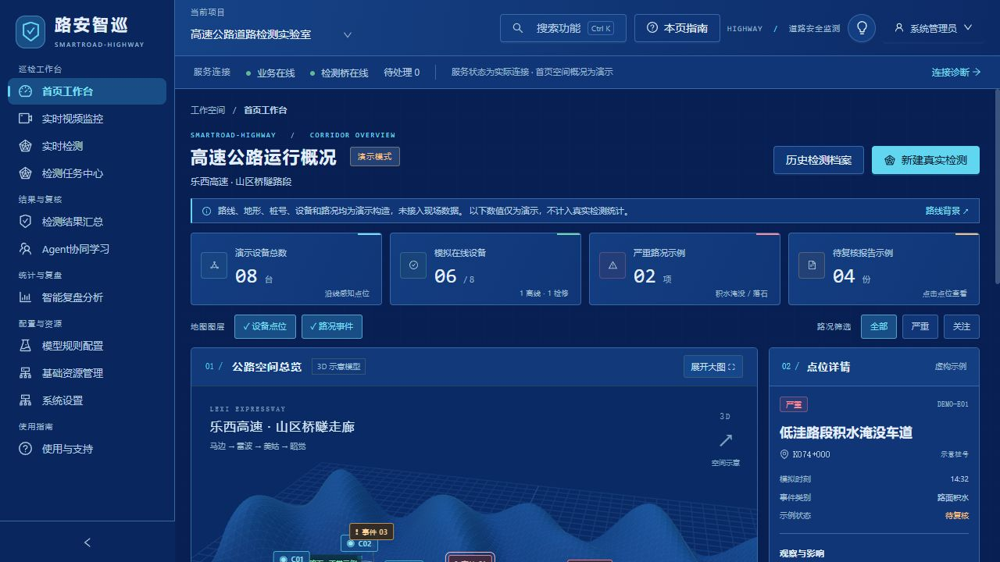
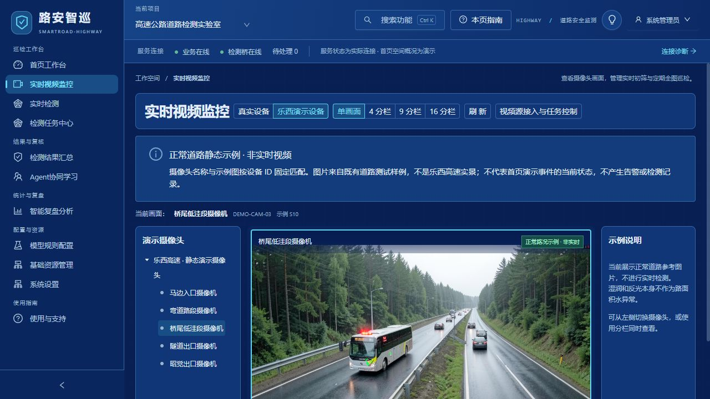

# 深蓝工业工作台与乐西高速三维概况

2026-09-22，基于 1.4.5 的前端功能更新。GitHub 主仓库按所有者要求公开，便于教学交流。

明亮模式现已提供[黑白水墨配色](INK_LIGHT_THEME.md)，深蓝模式保持不变。

## 已实现

- 全局深蓝底色、青色操作强调、细线面板与紧凑圆角，配色贯穿菜单、表格、弹窗和统计图。首次使用本版默认深色，仍可切换明亮模式并保存选择。
- 登录后的首页新增三维空间概况：山区地形、双向四车道路面、山谷桥梁和半透明隧道示意。
- 鼠标拖动旋转、滚轮缩放、右键平移；另有俯视、全线斜视、旋转、缩放、自动环绕与展开大图控件。Esc 退出大图。
- 8 台虚构设备：6 在线、1 离线、1 检修；4 份虚构路况报告：2 严重、2 关注。点位、设备台账和报告详情相互联动。
- 设备与事件图层可独立开关；事件可按严重程度过滤；报告可导出 Markdown。
- 普通湿润路面作为绿色正常示例；积水淹没车道、落石、散落杂物和疑似倾斜标志为演示事件。
- Three.js 本地打包，不依赖地图密钥、外部瓦片或在线三维资源。离开页面释放渲染资源；窗口隐藏或模型离开可见区域暂停渲染；限制像素倍率和刷新频率。
- 三维初始化失败或渲染连接丢失时提供二维示意与重试，设备和报告列表仍可使用。

## 数据含义

路线背景参考[四川乐西高速公路有限责任公司项目信息](https://lxgs.scgs.com.cn/2131/2/)中马边、雷波、美姑、昭觉的走廊关系。地形、线形、桥隧位置、桩号及设备均为程序构造，不对应真实测绘坐标或设施清单。

演示数据集中位于 `combine/ZNT/pc-admin/src/data/lexiDemo.js`，不写入后端数据库、真实检测任务、历史档案、业务工单或学习库。没有伪造现场原图、掩码、准确率或模型检测证据。首页服务条仍显示实际后端连接状态。

真实检测与历史档案通过首页按钮进入既有模块；本次界面更新不改变 Qwen / SAM3 的推理流程，也不新增模型性能结论。

## 验证范围

- 前端 33 项自动测试全部通过，包含演示点位关联、正常湿路不计异常、等级过滤和导出报告的来源标注；生产构建通过。
- 本机浏览器实测三维显示、俯视、旋转、缩放、大图退出、设备与风险详情、设备图层开关、等级筛选及报告下载请求。
- 浏览器控制台在上述操作后没有错误或警告。
- 二维降级路径已实现；本次未在无 WebGL 的实体机器上实测。未进行真实模型重测或现场接入验证。

## 深蓝主题与摄像头联动补充更新

背景改为更明显的深蓝色 `#081f54`，面板为 `#103677`，同步调整侧栏、标题栏、提示框和三维场景底色。

首页下方设备列表中，单击摄像头名称查看点位详情，双击进入该摄像头的监控单画面；键盘 Enter 也可进入。点位详情提供“查看监控示例”按钮。监控页支持单画面及 4、9、16 分栏，设备树切换后名称、设备 ID 与图片同步更新。

| 演示摄像头 | 固定参考图片 | 来源 |
| --- | --- | --- |
| C01 马边入口摄像机 | N02 白天正常道路 | UA-DETRAC |
| C02 弯道路段摄像机 | N04 正常通行道路 | UA-DETRAC |
| C03 桥尾低洼段摄像机 | S10 湿润高速路面 | 已有合成高速样例 |
| C04 隧道出口摄像机 | N03 湿润道路 | UA-DETRAC |
| C05 昭觉出口摄像机 | N01 夜间正常道路 | UA-DETRAC |

这 5 张图片取自既有测试档案中的原图。UA-DETRAC 图片包含城市道路，均不是乐西高速对应点位的实景，也不代表首页虚构事件的当前状态。监控页明确标注“正常道路静态示例，非实时视频”；该功能不执行模型检测，不生成告警、工单或历史检测记录。来源与文件校验值见 `combine/ZNT/pc-admin/public/media/road-monitor/provenance.json`。

“乐西演示设备”与“真实设备”可分别选择。真实设备接口或视频流失败时显示错误，不自动替换为演示图片。

补充验证：前端自动测试共 37 项通过，生产构建通过。浏览器实测首页双击 C03、C05 跳转、设备树切换 C02、单画面及 4 分栏图片匹配，以及真实接口不可达时不显示示例图片。开发环境接口不可达测试出现网络错误属于该失败分支的预期现象；此处不声称真实摄像头接入或模型重测通过。

## 后续接入位置

先接入真实道路中心线、地形或轻量模型，再将设备资产和检测事件映射到统一道路位置；来源类型、坐标系统和定位置信度应分别记录。当前示意桩号不能直接充当真实事件定位。三维渲染模块与首页业务展示分开，真实数据适配时应保留演示模式的独立来源标记。

本次交付为源码与本机前端更新；原 v1.4.5 安装包仍是此前发布内容，没有将该功能冒称为已重新打包的安装版本。
