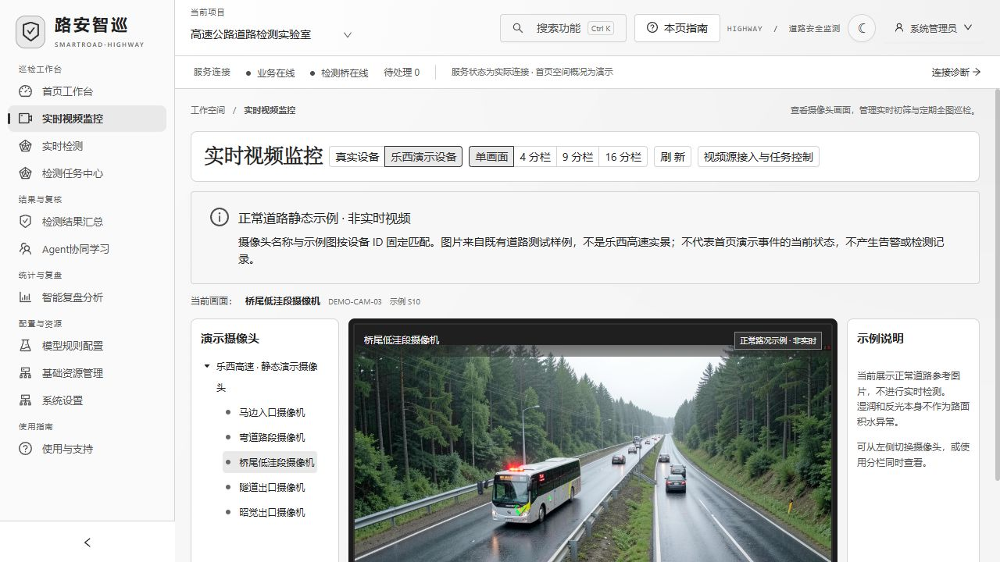

# 黑白水墨明亮模式

2026-09-22，基于 v1.4.5 的前端界面更新。

## 使用

登录后点击右上角主题按钮，切换到明亮模式。明亮模式使用纸白底色、墨黑文字、灰阶面板和宋体标题，普通操作、正常状态和链接均使用黑白灰。选择会保存，下次启动继续使用。

首页三维道路模型的地形、路面、设备与普通标注同步采用灰阶。仍可旋转、缩放和展开；切换主题不重建模型，也不重置当前视角。严重和关注事件继续保留原有红、黄警示。

监控示例的标签改为黑白灰。道路照片、视频及检测证据掩码保持原色；本次没有对检测图像进行灰度处理。登录页、弹窗提示和普通图表也使用明亮模式的灰阶配色。

深蓝模式及其颜色定义保持原样。黄色、橙色、红色的警示与危险操作配色不变。

## 验证与交付

- 现有 37 项前端自动测试通过，包括明暗主题文字对比度、组件配色一致性与摄像头匹配；生产构建通过。
- 浏览器检查首页黑白样式、三维展开和旋转、明暗切换、监控示例、弹窗；可见文字检查未发现绿色普通文字。
- 备份后更新本机前端，已有历史档案与配置进行 SHA256 比对；详细结果随本机交付目录中的 `deployment.json` 提供。
- 本次仅更新显示样式，不产生新的模型测试结论。没有重新生成完整安装包。

