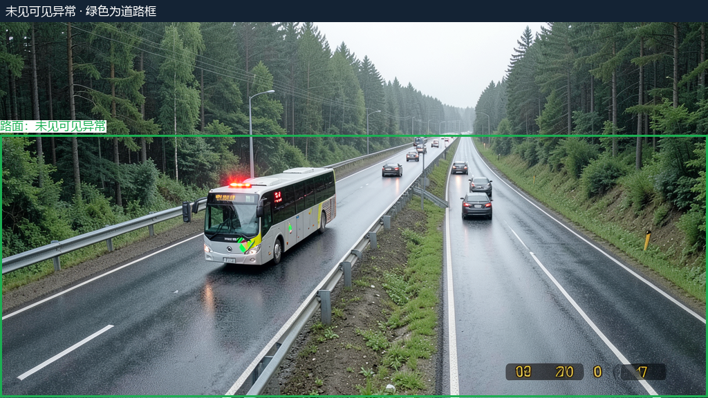
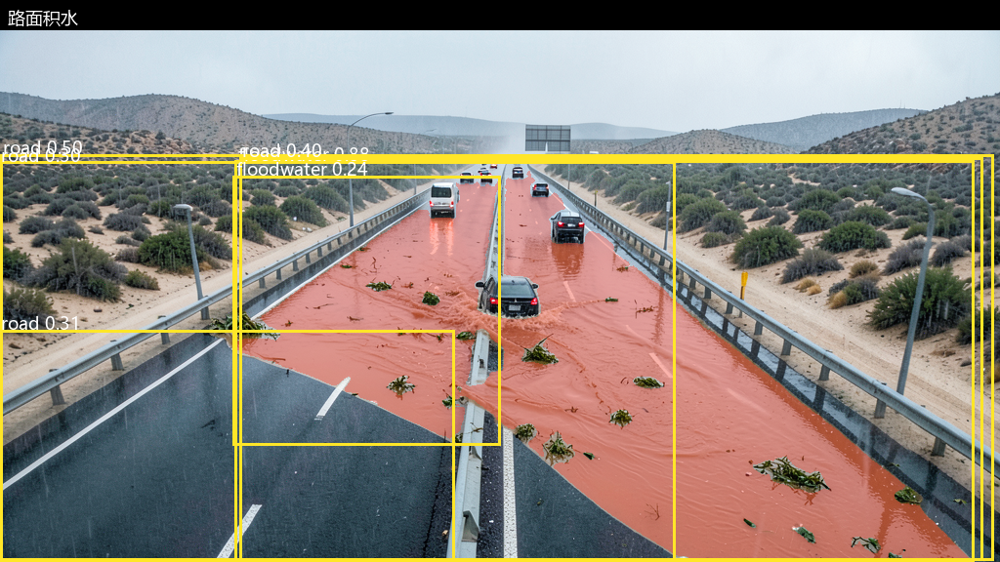
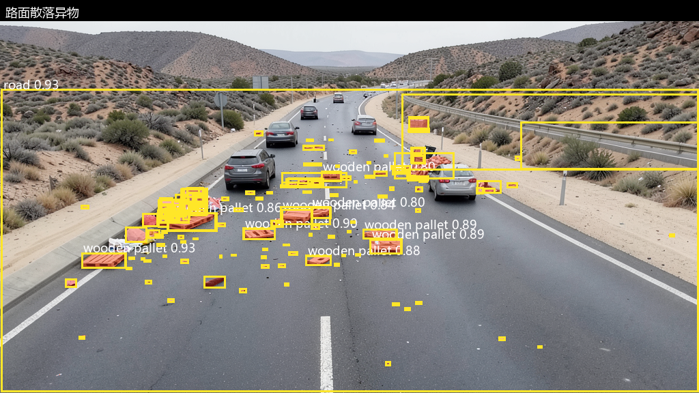
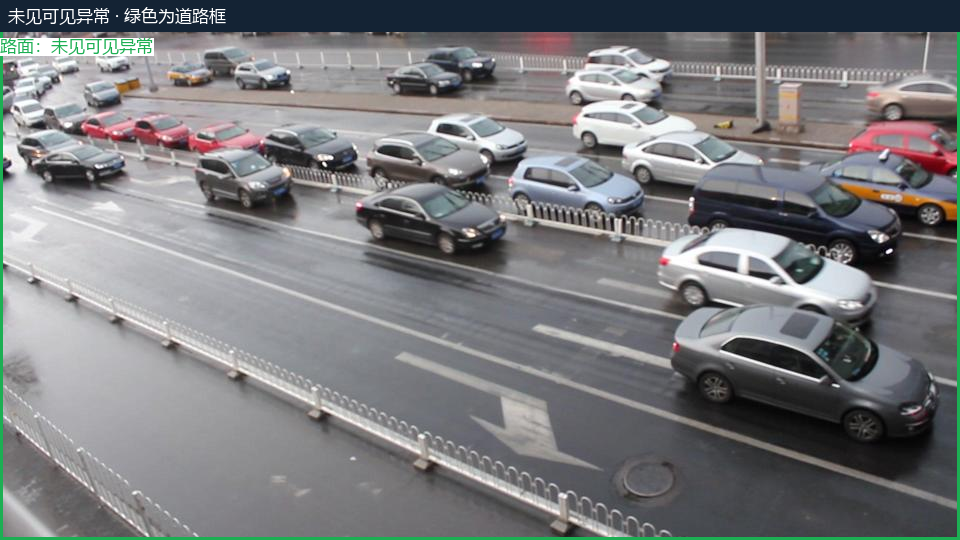

# 路安智巡：项目介绍与测试分析

当前软件：1.4.5；以下模型检测分析沿用 1.4.4 道路 v5 记录；验证日期：2026-09-22；阶段：实验室小试。

1.4.5 将历史图像归档纳入安装包，可导入并保留原图、标注、掩码和逐图报告，正常场景也能查阅；升级保留已有档案。新增工程验证见 [1.4.5 发布验证](validation/v1.4.5/README.md)。本次软件发布没有形成新的模型检测成绩。

路安智巡面向高速公路建设与管理方，研究如何把摄像头图像中的异常线索转化为有位置、有图像证据、有处置参考、可持续复核的风险记录。当前重点是服务器端大模型分析：由 Qwen 描述场景并提出候选风险，SAM3 定位已观察到的对象，再通过视觉复核和规则检查组织带图报告。端侧实时筛选模型尚未训练，当前结果不代表完整实时监测系统已通过现场验收。

## 从图像到可复核报告

1. **观察场景。** 区分道路类型、可见对象、普通湿路与积聚水体，保留不确定信息。
2. **编译定位任务。** 同一图像可以有多种风险；将观察中的对象转换成单一概念短提示词，避免把复杂整句直接交给 SAM3。
3. **定位并复核。** 保留多个实例，分别检查风险存在性、定位质量和对道路的影响；不因生成掩码就直接确认异常。
4. **生成问题报告。** 按风险 ID 绑定原图、叠加图、掩码与复核结论，附道路法规检索参考，避免不同风险的图片串配。
5. **保留人工结论。** 模型证据支持与人工业务确认分开记录，反馈用于分析后续规则和模型的改进方向。

系统关注的候选类型包括路面破损、水体淹没、散落物、阻塞、路基塌方、疑似火情及交通设施异常。单张图片不能确定水深、污水成分、事故责任、车辆状态持续时间或道路是否可以安全通行。

## 已完成的测试

真实 Qwen3-VL 与 SAM3 对固定的 10 张高速合成图和新增 5 张 UA-DETRAC 正常候选图执行开发回归。5 张真实图来自不同视频序列，主要是城市道路，用于检查普通湿路、车流与行人是否被误套为高速异常。数据集标签、生成提示词和正常样本标记没有输入模型。

| 项目 | 观察结果 | 正确解释 |
|---|---|---|
| 流程完成 | 15/15，运行错误 0 | 表示程序完成任务，不表示 15 张全部识别正确 |
| 保留风险 | 17 项、对应叠加图 17 张 | 一张图可以有多个标签；不是 17 项人工真值 |
| 自动证据支持 | 7 项 | 程序认为观察与定位证据相符，不等于准确率 |
| 新增正常候选 | 5/5 输出未见可见异常和绿框 | 描述本次小样本结果，不能估计全场景误报率 |
| 合成湿路 S10 | 未保留异常候选 | 普通湿润反光没有单独触发积水告警 |
| 耗时 | 总计 254.93 秒，平均 17.0 秒/张 | 不含模型加载，不是视频实时吞吐或服务 SLA |

测试过程也保留了失败轮次。最初一轮有 6 张因多实例证据超过 Qwen 上下文限制失败；随后将复核输入压缩为概念、实例数量和代表框摘要，完整实例仍保存在原始证据中。最终轮次全部完成。以上属于同一批样本上的开发诊断，不能包装为独立测试集成绩。

## 四个案例说明

### 普通湿路：S10

可见湿润反光、车辆与路灯，未见明确水体淹没。系统输出绿色道路框、未保留异常候选。这里的“正常”是该图未见可见异常，并不对整个路段作安全担保。

### 大范围水体覆盖道路：S02

画面中的浑浊水体覆盖多个车道，模型保留积水风险，并输出 `floodwater` 对应掩码。它与仅有湿润反光的场景在语义上已有区分；但 SAM3 仍可能把部分湿路、反光或背景包含进水体范围，因此风险是否存在与边界是否精确需要分别评价。

### 散落物与多标签：S04

木托盘、纸箱和碎片分布在多个车道。系统保留“路面散落异物”和“道路阻塞”两项观察，使用独立概念定位并按风险绑定证据。其中散落物获得内部证据支持，阻塞的定位复核未通过。图中仍有过多小框、背景同类目标和碎片漏选，不能把框的数量视作准确物体计数。

### 真实雨后城市道路：N03

车辆排队与湿路面反光未直接触发事故、道路阻塞或淹水告警，输出绿色道路框。UA-DETRAC 的车辆标签不是道路异常真值；该城市样例可检验部分误报问题，但不能替代真实高速正常雨天样本。

这些预览是原始预测图片的逐字节副本，没有人工修补掩码。预览仅用于讲解；完整报告展示所有 15 张样本，不按结果好坏挑选最终统计。

## 下一步应解决的问题

| 问题 | 改进方向 | 需要补充的验证 |
|---|---|---|
| 水体与湿路边界混合 | 增加实例级接受/拒绝和有次数上限的定位修复 | 真实高速湿路与淹水成对样例、人工水体掩码 |
| 碎片漏分、背景目标多分 | 结合局部视图与道路影响复核，评估不同尺寸目标 | 按目标大小统计漏检与误分，不能只统计有没有掩码 |
| 从车辆共现推断事故 | 要求碰撞、破损、侧翻等直接证据，保留不确定性 | 正常排队、停车、故障与事故的对照图像及连续视频 |
| 正常样本范围不足 | 扩充真实高速白天、夜间、雨雾和设施正常场景 | 固定独立验证集，记录人工标签和评价口径 |
| 自动报告进入管理流程 | 继续验证人工反馈、消息接收和报告追溯 | 普通微信对接、视频时序、现场管理流程分别验收 |

## 完整报告与工程验证

- [完整带图分析报告 HTML](https://github.com/Shrek2356/SmartRoad-Highway/releases/download/v1.4.4/road-v5-analysis-report.html)：内嵌 47 张图，下载后在浏览器中打开。
- [报告与原始附件 ZIP](https://github.com/Shrek2356/SmartRoad-Highway/releases/download/v1.4.4/road-v5-analysis-bundle-20260922.zip)：包含 HTML、Markdown、15 张输入、逐图输出、掩码、结构化 JSON、抽样清单与日志。完整解压后保留目录结构，报告中的相对链接才可用。
- [工程验证摘要](validation/v1.4.4/README.md)：包括后端、前端、安装包及实际升级验证；工程测试和模型检测评价分开记录。
- [安装包与构建收据](https://github.com/Shrek2356/SmartRoad-Highway/releases/tag/v1.4.4)。

报告中的生成图与 UA-DETRAC 样本仅用于本私有项目的开发分析。完整数据集和模型权重不包含在本仓库中。

## 两个仓库与安装名称

`SmartRoad-Inspection` 是最初的迁移仓库，2026-09-13 创建；本次核对时，其远端 `main` 仍为早期基线 `4740ff3`。原本地目录 `源码/ZNT_Submission` 上积累了后续道路修改，但这些修改当时尚未全部推送到旧远端。

`SmartRoad-Highway` 是 2026-09-22 按要求新建的私有主仓库，已同步当前道路 v5 源码、1.4.4 发布与验证材料；后续使用这个仓库。旧仓库保留作历史参考，本次没有删除或归档它。

软件仍叫 `SmartRoad-Inspection.exe`，安装目录也叫 `SmartRoad-Inspection`，属于现有安装与升级标识；里面运行的是已升级的 1.4.5 道路版。`Inspection` 的意思是巡检、检测，它不是额外运行的模型，也不是第二套独立产品。
