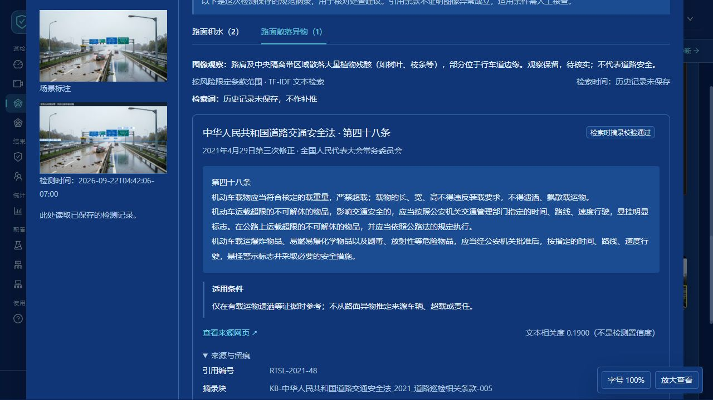
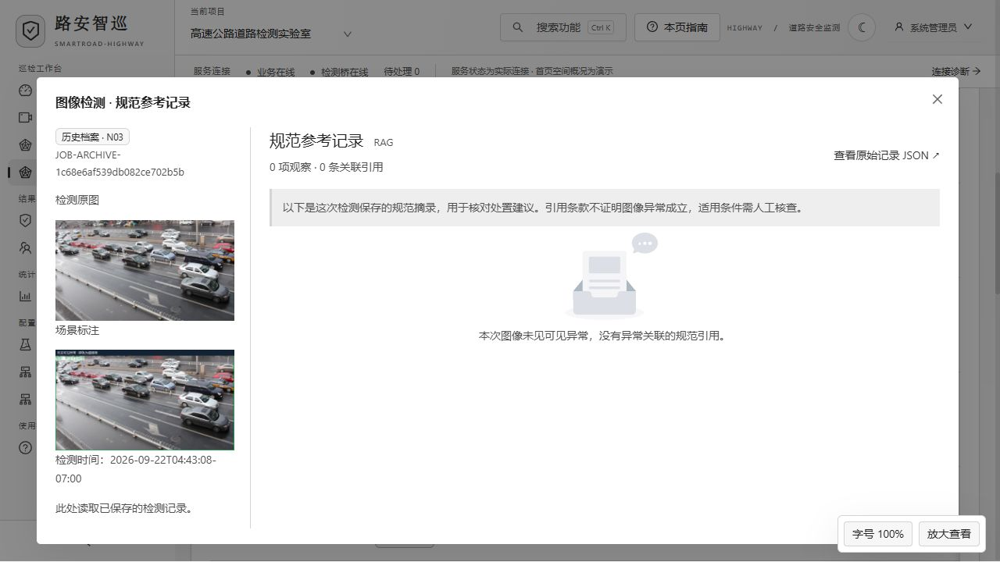
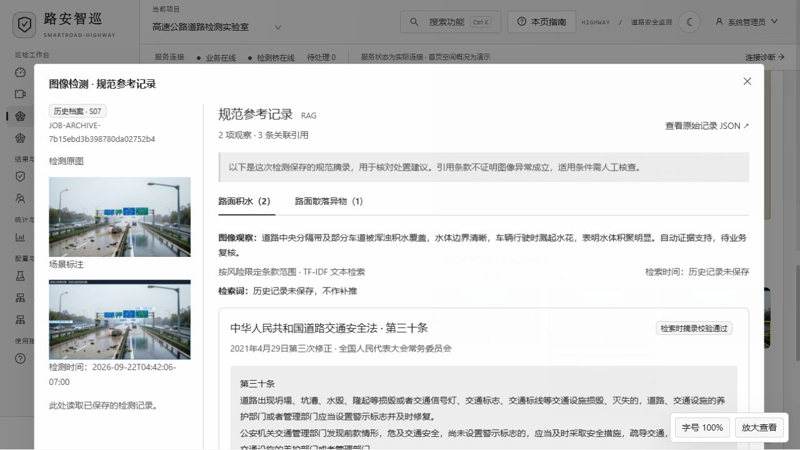

# 图像检测的规范参考记录

从 v1.4.7 起，可以将检测图像与本次保存的道路规范参考并排查看。

## 打开方式

- **实时检测**：在检测结果上方点击“规范参考记录”，按钮显示关联引用数量。
- **检测任务与历史档案**：已完成任务的操作栏点击“规范参考”。历史记录不需要重新运行模型。
- **检测结果汇总**：已关联真实任务的结果卡片点击“规范参考”。预设展示图片不会冒充有实际检索记录。

弹窗左侧显示检测原图、场景标注及样本编号；右侧按异常标签分别展示规范。点击“路面积水”“路面散落异物”等标签可切换，一张图的多个风险分别对应自己的条款。

## 记录内容

每条引用包含规范名称、条款、版本、原文摘录、适用条件、来源网页及文本检索相关度。“来源与留痕”可展开查看引用编号、摘录块、资料采集时间、来源文件和摘录 SHA-256。

新检测同时保存检索词、检索时间、限定条款范围、最多返回条数、最低相关度、来源过滤条件及匹配状态。原始记录保存在任务的 `regulatory_references.json`，自动问题报告也包含检索记录。界面可以打开原始 JSON 核对。

检索采用预设风险条款范围内的 TF-IDF 文本检索，仅引用校验通过的来源摘录。相关度表示文本匹配程度，不是图像异常置信度。条款用于人工核查处置条件，不替代视觉证据、现场核验或违法认定；来源校验通过也不等于完成法规现行效力核验。

## 历史兼容与空记录

已有档案使用当时保存的规范快照，不根据当前知识库重新检索，也不改写历史文件。旧记录没有检索词或检索时间时，明确显示未保存；不会把资料采集时间当成本次检索时间。

界面区分正常图像无异常引用、已检索但无校验通过的条款、未配置该类风险的检索范围、历史未保存记录和文件无法读取。查看失败可重试，不影响历史原图查看。

## 本次验证范围

- 前端 45 项测试通过，含多标签引用归属、空记录分类、链接过滤、相关度显示、接口代理路径；生产构建通过。
- 后端相关 27 项测试通过，含新记录持久化、无匹配与未配置的区分、历史读取不重检索不改写、历史导入和道路规范来源校验。
- 浏览器检查实际历史 S07：积水 2 条、散落异物 1 条，切换正常；N03 为 0 条；深蓝和水墨主题可读，历史入口正常。
- 新检索记录的测试使用隔离测试事件和实际随包知识库，不声称重新完成真实 Qwen/SAM3 检测。

